# BudgetApp – Simple Budget Management Application

BudgetApp is a console-based application written in **C++**, designed to help users manage their personal finances.  
It allows tracking incomes and expenses, calculating balances for different time periods, and storing data in XML files.

---

### Description
This application enables users to:
- Register and log in to the system,
- Add incomes and expenses,
- View a list of financial operations,
- Display balance for the current month, previous month, or a custom date range,
- Manage user accounts (change password, log out).

All data is stored in XML files and filtered by the logged-in user ID, ensuring that each user sees only their own operations.

---

## Table of Contents
- [Project Structure](#project-structure)
- [UML Diagram](#uml-diagram)
- [Data Storage](#data-storage)
- [Menu](#menu)
- [Users](#users)
   - [Login and Registration](#login-and-registration)
   - [Password change](#password-change)
   - [Logout](#logout)
- [Financial Operations](#financial-operations)
   - [Adding Operations](#adding-operations)
   - [Operations and balance view](#operations-and-balance-view)
   - [Display balance](#display-balance)
- [Tests](#tests)
- [Future Improvements](#future-improvements)

---

## Project Structure

The project consists of several classes and helper structures:

- **BudgetMainApp** – main application class, handles menus and control flow.  
- **UserManager** – manages users (registration, login, password change).  
- **BudgetManager** – manages financial operations (adding, displaying, calculating balance).  
- **OperationFile** – handles saving and loading operations from XML files.  
- **UserFile** – manages persistence of user accounts in XML.  
- **File** – base class for file handling.  
- **AuxiliaryMethods** – helper functions for input/output validation.
- **DateMethods** – helper functions for date validation and conversion.  
- **CashMethods** – helper functions for amount validation.  

**Data structures:**
- `struct User` – represents a user account and contains id, login, password, name, surname.  
- `struct Operation` – represents a financial operation and contains id, userId, date, item, amount, type.  
- `enum class Type` – defines `INCOME` and `EXPENSE`.

---

## UML Diagram
The following UML diagram was created using UMLet version 15.1 and illustrates the main classes and their relationships:

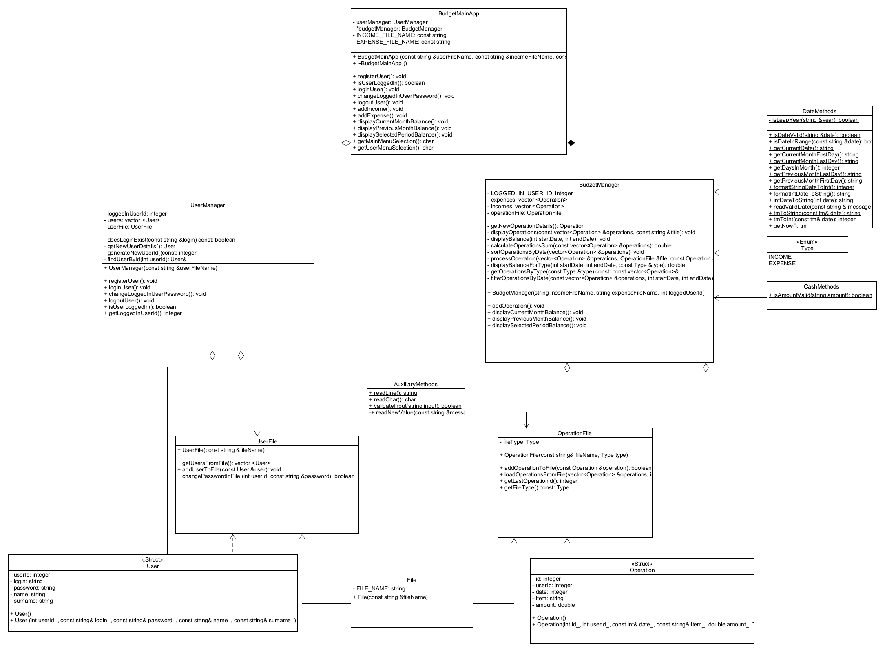 

---

## Data Storage

The application uses XML files:
- `users.xml` – stores user accounts,
- `incomes.xml` – stores incomes,
- `expenses.xml` – stores expenses,

Each user account contains:
- `id` – unique user identifier,
- `login` – unique user login,
- `password` – password to user account,
- `name` – user name,
- `surname` – user surname.

User account view in users.xml:

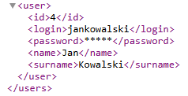

Each operation contains:
- `id` – unique operation identifier,
- `userId` – ID of the user who owns the operation,
- `date` – operation date,
- `item` – description,
- `amount` – value of the operation.

Income view in incomes.xml:

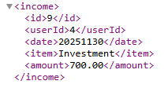

Expense view in expenses.xml:

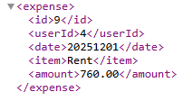

Operations are filtered by `userId`, so each user sees only their own data.

---

## Menu

Main menu allows a new user to select basic operations related with registation and login.

Main menu console view:

User menu is available only for logged user and allows to select operations related with finance and user account management.

User menu console view:

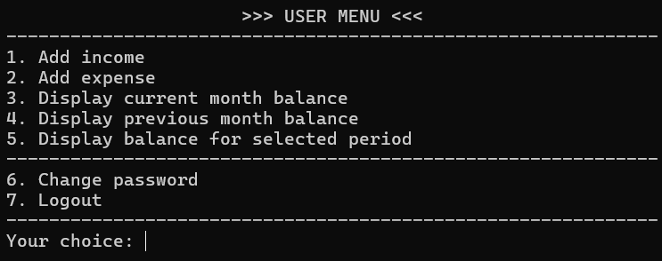

---

## Users

### Login and Registration

Registration creates a new user in users.xml.
Login verifies credentials and assigns LOGGED_IN_USER_ID.

Registration console view:

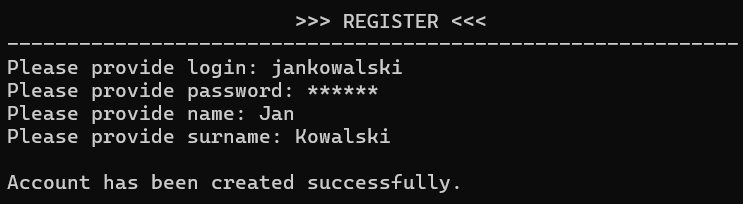

Login console view:

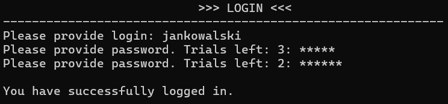

### Password change

Password change updates a user password in users.xml.

Password change console view:

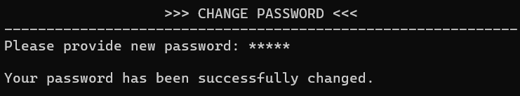

### Logout

Password change console view:

---

## Financial Operations

For a logged in user are available financial operations below:
- adding operations,
- viewing operations and balance tables,
- displaying balance for selected period.

### Adding Operations

Adding an income or expense is done through a console form and creates a new operation in incomes.xml and expences.xml accordingly.
Below are screenshots showing the actual console output:

#### Add Income

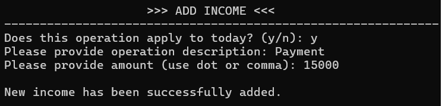

#### Add Expense

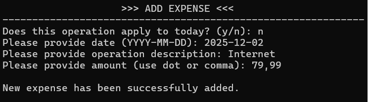

### Operations and balance view

Operations are displayed in a table with columns: Date, Item, Amount.

#### Income view

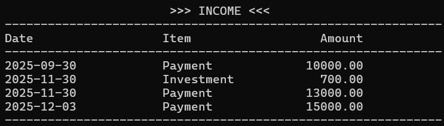

#### Expense view

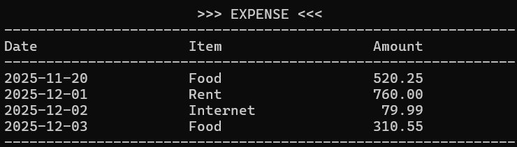

#### Balance view

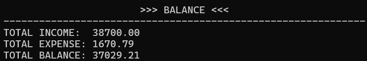

### Display balance
Balance can be displayed for:
- Current month,
- Previous month,
- Custom date range.

Below are screenshots showing the actual console output:

#### Current month balance

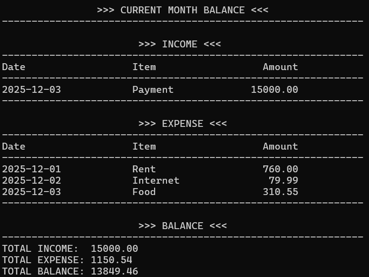

#### Previous month balance

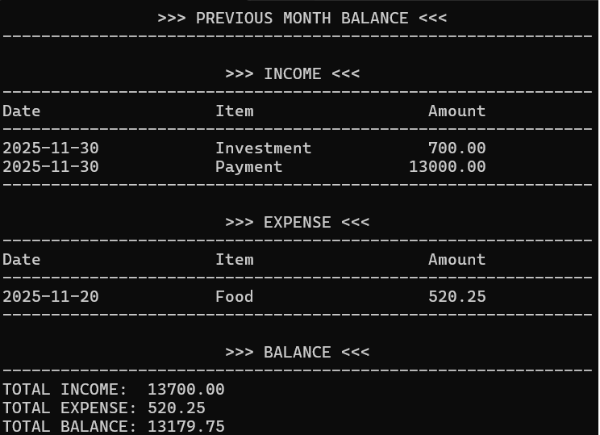

#### Balance for selected period

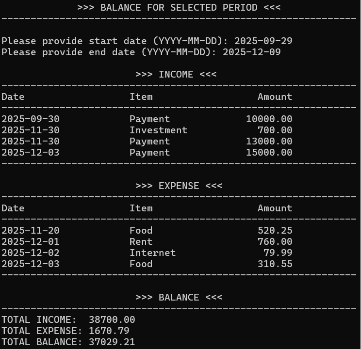

---

## Tests
Unit tests cover:
- Date and amount validation,
- Adding and filtering operations,
- XML file handling,
- Balance calculation logic.

---

## Future Improvements
- Better table formatting with dynamic column widths,
- Extended test coverage,
- Exporting data to external formats.

